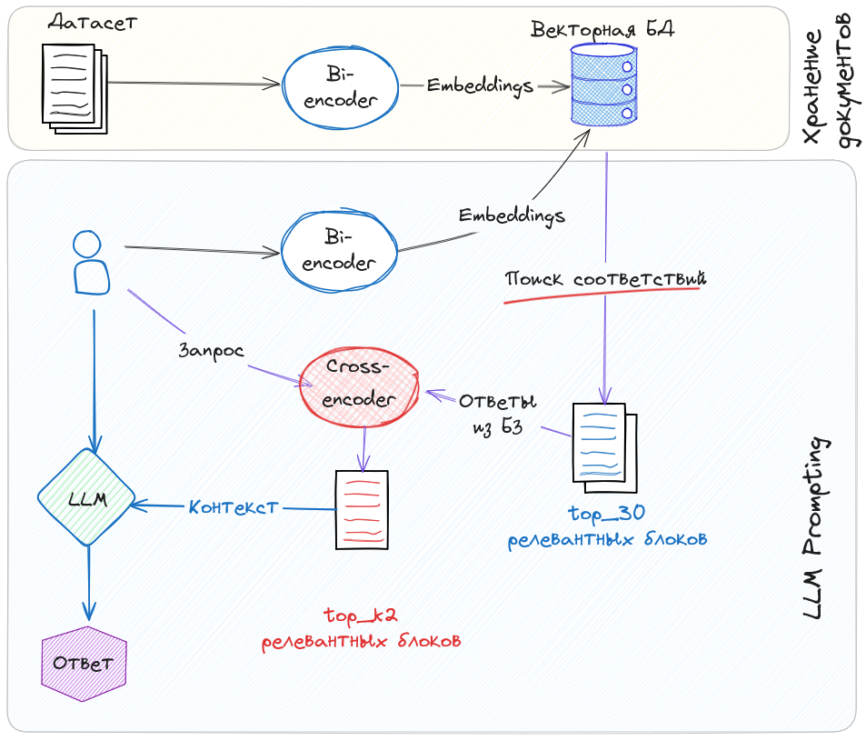
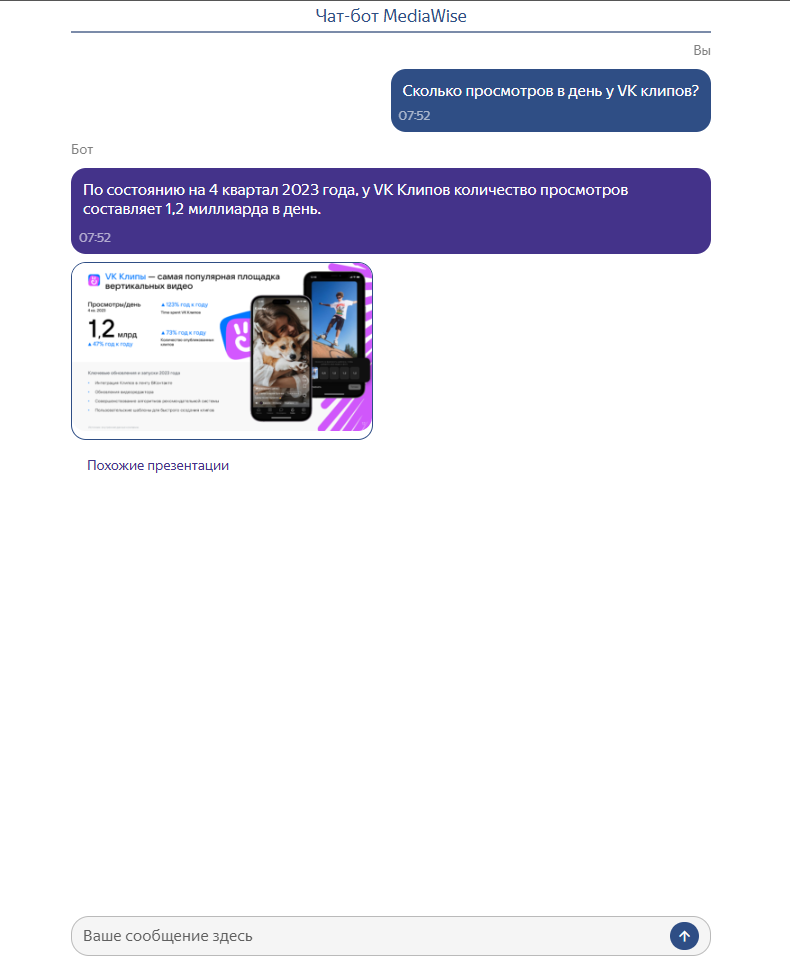
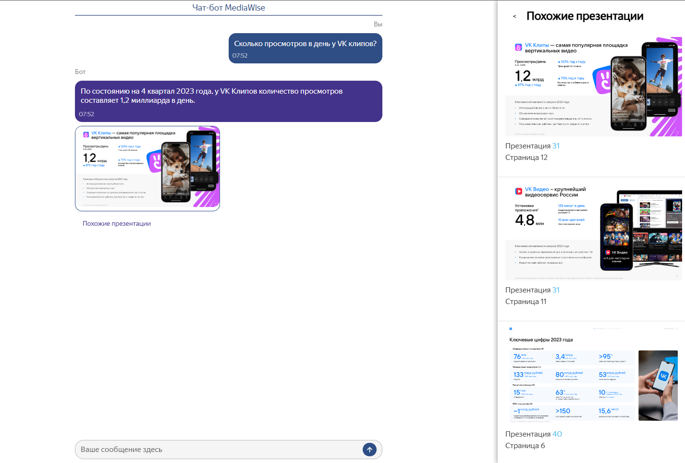
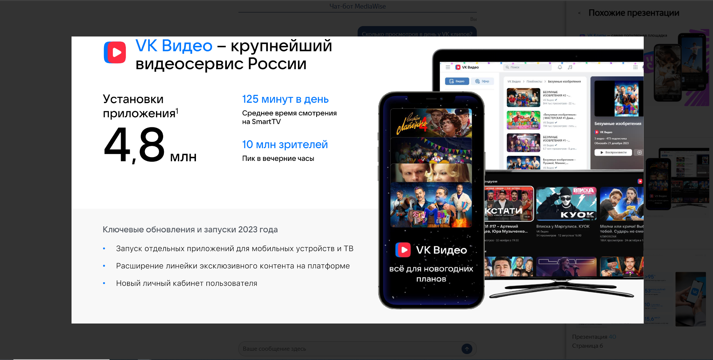

# ladno-smazan

 # :robot: AI Assistant for Advertising Agency Data Search 

## :building_construction: ## Описание проекта

Этот проект представляет собой готовое решение для рекламных агентств, позволяющее эффективно искать информацию в больших массивах данных, что ускоряет процесс принятия решений и разработки стратегий. Разработанный чат-бот с веб-интерфейсом предоставляет удобные инструменты для быстрого поиска релевантной информации в библиотеке материалов агентства, которая включает текстовую и презентационную информацию.

Решение реализовано с помощью мультомодального поиска и генеративной моделью.Cхема  выглядит следующим образом:
 

# :checkered_flag: Основные проблемы и решения

## :hugs: Метрики 
Для валидационного датасета,мы подготовили 500 вопросов,из которых 277 были созданы вручную,а остальные были сгенерированы.Для каждого вопроса,мы указывали номер страницы,номер документа.Релеватный отрывок из текста,модальность данных(текст,изображение или картинка).
1. Количество документов попаданий в топ-1,5,10 документов общего датасета.
2. Страниц документов попаданий в топ-1,5,10 документов общего датасета.
3. Соответствие ответа LLM ответа из тестового датасета.

## :exploding_head: Обработка исходных PDF документов

Мультимодальный ретривер ColPali (https://huggingface.co/vidore/colpali-v1.3)
Основная сложность заключалась в том, что важные сведения были распределены между визуальными и текстовыми частями документа. К примеру, количественные показатели могли находиться в одном изображении, а их объяснения - либо в другом изображении, либо в тексте. Из-за такой фрагментированной организации информации было непросто корректно соединить и осмыслить все связанные данные. Изначально использовали библиотеку docling для обработки таких документов c пременением OCR: EasyOCR, Tesseract, Surya но это обработка затянулась на часы.
 

## :hugs: Ключевые технологии

1. мультимодальный ретривер, захватывающий текст и изображение в единый вектор.
Выбрали ColPali потому что:
    - в 20 раз быстрее библиотек docling+OCR (сейчас страница обрабатывается около 20сек)
    - является одним из лучших мультимодальных ретриверов. ссылка(https://huggingface.co/spaces/vidore/vidore-leaderboard)
    - не взяли топ-1 colbert потому что на нашем датасете (500 вопросов, 50/50 ручные и синтетические). Очевидно потому что colpali обучался на multilingual-датасете 

2. LLM Vikhr-2.5-VL-2b-Instruct, потому что:
    - обучена на российском наборе данных
    - основана на QWEN c открытой лицензией до 100млн пользователей 

3. Инференс: V-LLM, потому что:
    - Быстрая генерация параллельных ответов
    - Легко масштабируется
    - Инференс: GPU 1x4080 16Gb
    
## Подготовка данных и создание векторного хранилища

1. **Сбор документов**:
   Пользователь загружает документ,документ разбивается на картинки png.Пользователь может загрузить документы в базу данных более чем в 10 форматах('*.rtf', '*.doc', '*.docx', '*.pptx', '*.csv', '*.txt', '*.pdf', '*.png', '*.jpg').

2. **Ретривер**:
   Мы используем мультимодальную эмбединг модель для разбиение pdf файлов и других документов.

   Этот шаг разделит pdf файл на страницы и каждую из них преобразует в текст, описав изображения при помощи мультимодальной эмбединг модели.

3. **Генерация модели**:
   На основании запроса пользователя выбираются наилучшие страницы документов на основании,которых будут сгенерированы ответы.

## Запуск приложения

Решение упаковано и будет готов к работе через **2 строки**

 **Для запуска нужны**
 - docker
 - docker-compose
 - make

   Теперь вы сможете взаимодействовать с чат-ботом и задавать вопросы.

 # :computer: Пример использования

После запуска приложения вы сможете задать свой вопрос, и система сгенерирует ответ на основе информации, найденной в документах,а также выведет результаты похожих слайдов презентаций и журналов в базе.

1. Чат-бот верно отвечает на вопросы по pdf документам
   
   

2. Чат-бот получает ответ и от похожих слайдов в базе данных.
   

3. Чат-бот позволяет увеличить слайд,который он вывел пользователю для удобства и читаемости.
   

## made with ♥️ by AiRina for 

